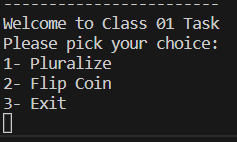

## To run this code 
1. Clone the repo from the root directory 
2. cd into the **basic** directory
3. `Javac Main.java`
4. type `java Main` on your terminal

 once the Program runs you will find a program menu
 such like this one 
 

 ## How this works

1. Insert the option that you want **note that you need to type numbers(1,2,3,4,etc...)**
    - Assume That you chose option 2 
    - I inserted the flips number of 2
    - And this is the result
    
2. to exit the program type the number refers to exit option.

**very important note when you choose the clock option you need to press ctrl+c in order to exit the program**